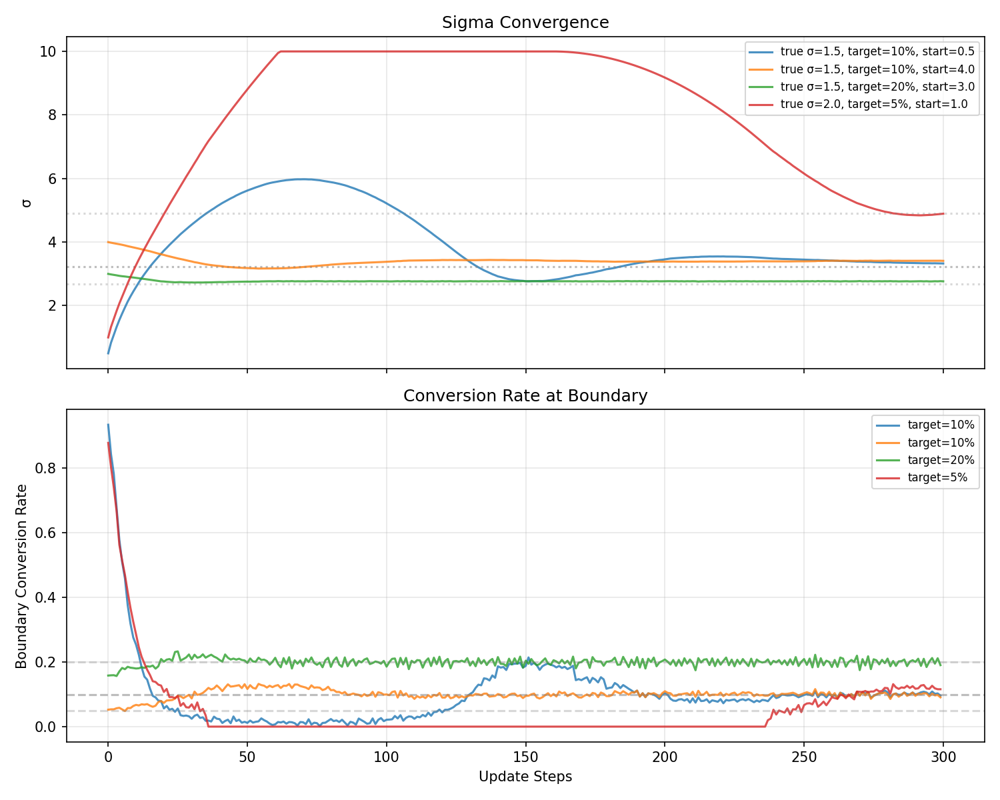
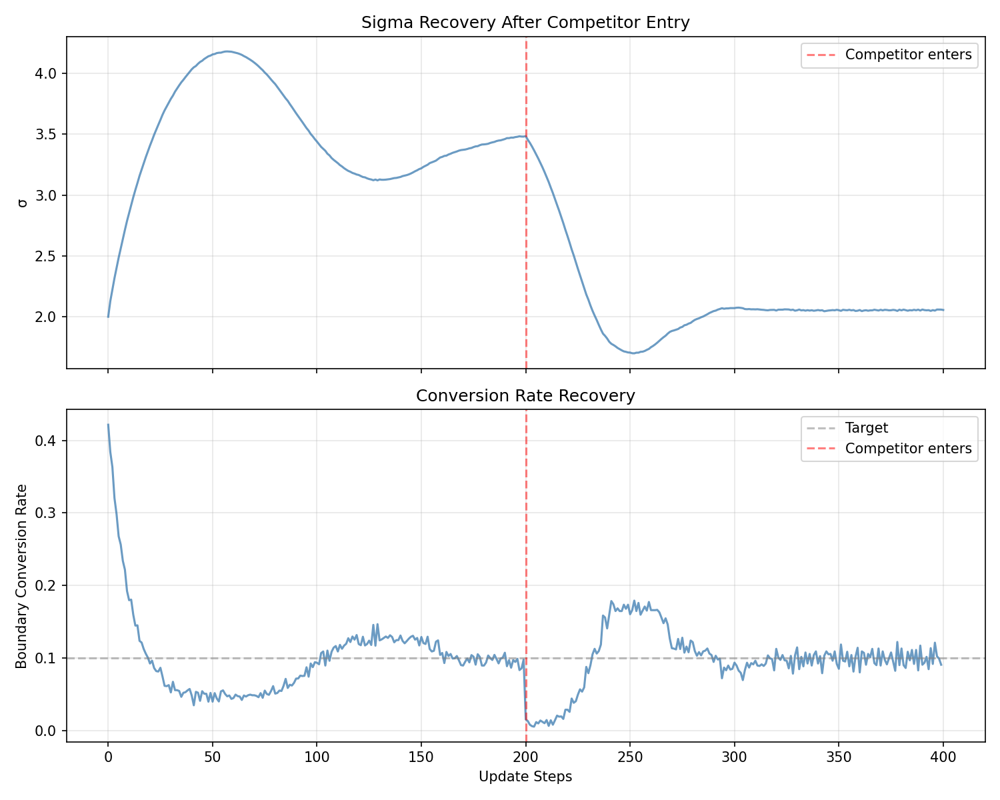
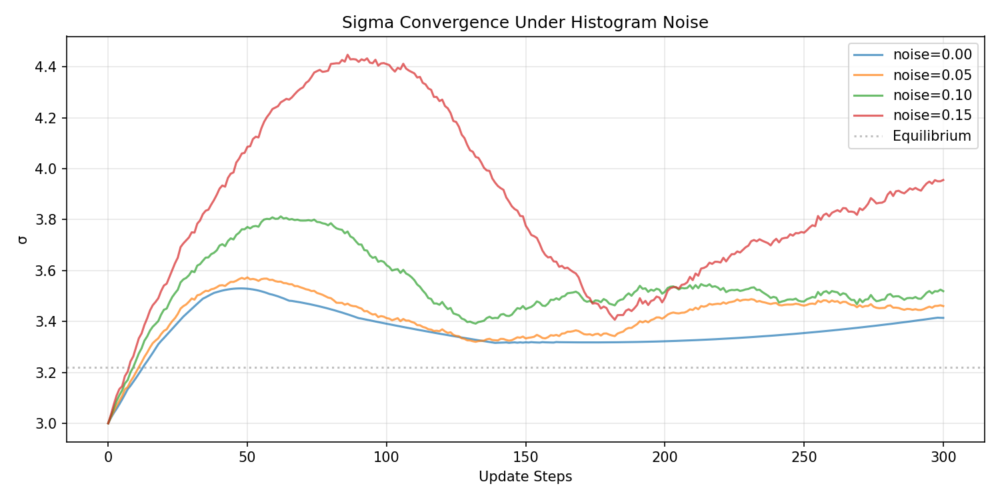
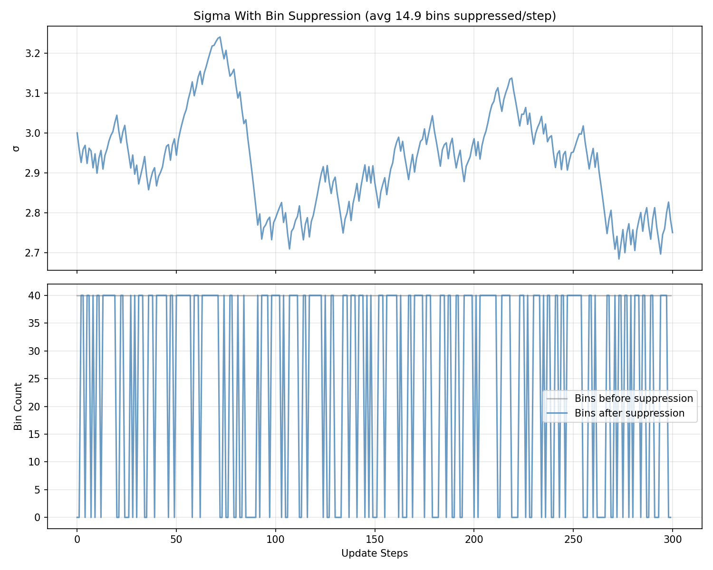
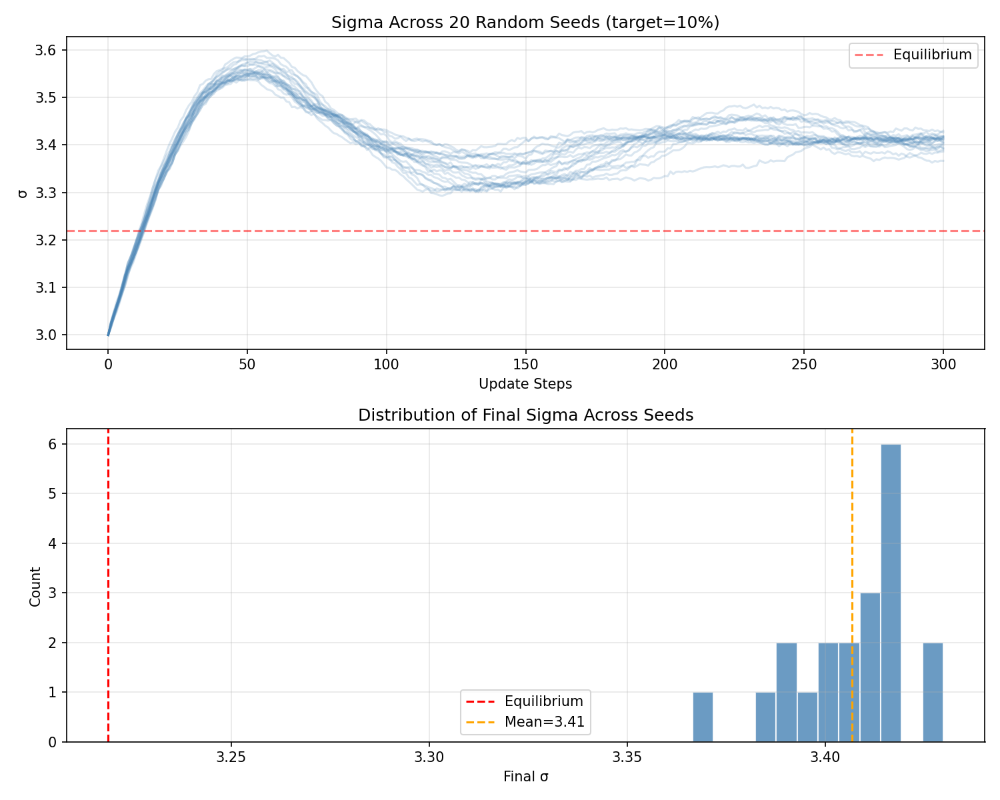

# sigma-controller

PID controller for sigma — the advertiser's reach parameter in a [power-diagram ad auction](https://kimjune01.github.io/set-it-and-forget-it).

The advertiser sets a margin. The exchange observes conversion rates at different distances via distance histograms and verified conversions. The controller adjusts sigma to track the boundary where conversions remain profitable.

## How it works

- **Distance histograms.** The publisher reports aggregated conversion counts per distance bin. No individual embeddings, no timestamps.
- **PID feedback loop.** If the conversion rate at the boundary is below the target the advertiser's margin can sustain, sigma tightens. If it's above, sigma expands. Integral and derivative terms handle drift and sudden changes.
- **Initial estimate from data.** `estimate_sigma_from_curve` fits the Gaussian decay curve before the PID loop takes over.

## Simulation results

`uv run --with matplotlib simulate.py` runs convergence and shock scenarios with synthetic Gaussian histograms.

### Convergence

The controller converges to equilibrium from different starting points. Equilibrium is the distance where the conversion rate equals the target (where expanding further is no longer profitable):

| True σ | Target | Start | Equilibrium | Final σ | Error |
|--------|--------|-------|-------------|---------|-------|
| 1.50 | 10% | 0.50 | 3.22 | 3.33 | 0.109 |
| 1.50 | 10% | 4.00 | 3.22 | 3.41 | 0.191 |
| 1.50 | 20% | 3.00 | 2.69 | 2.77 | 0.075 |
| 2.00 | 5% | 1.00 | 4.90 | 4.89 | 0.002 |

Both undershooting and overshooting initial guesses converge to the same equilibrium:



### Competitor entry

When a competitor enters adjacent territory (effective conversion curve narrows by 40%), the derivative term detects the drop and sigma contracts to maintain the target boundary rate:



### Initial estimate

`estimate_sigma_from_curve` bootstraps a reasonable sigma from a single histogram before the PID loop takes over. From a bad initial guess of 5.0, it estimates 2.19 against a true σ of 1.5 — close enough for the PID to converge quickly.

### Noise robustness

Real histograms have sampling noise. The controller converges under noise levels from 0% to 15%:



### Bin suppression

When bins have fewer than 11 impressions (CMS cell suppression threshold), they're automatically dropped. The controller still converges with reduced data:



### Robustness across seeds

Same scenario (true σ=1.5, target=10%) run across 20 random seeds. Mean final σ: 3.41 (equilibrium: 3.22):



## Privacy and security

This code is designed for exchanges handling HIPAA/FTC-regulated publisher data.

- **Aggregated data only.** Inputs are distance histograms (bin counts), never individual embeddings or user data.
- **Minimum bin size enforcement.** `validate_histogram` suppresses bins with fewer than 11 impressions (CMS cell suppression threshold). Bins below this are dropped before any computation.
- **Thread-safe.** All shared state is protected by locks for concurrent request handling.
- **Anti-windup.** The PID integral is clamped to `integral_max` to prevent runaway corrections from adversarial histogram spikes.
- **No network, no disk, no logging.** Pure computation. Nothing leaves the process.

## Usage

```python
from pid import SigmaController, DistanceBin

controller = SigmaController(target_rate=0.05)  # 5% conversion rate at boundary

# Each update cycle, feed in the latest distance histogram
# Bins below min_bin_size (default 11) are automatically suppressed
histogram = [
    DistanceBin(distance=0.5, impressions=100, conversions=80),
    DistanceBin(distance=1.0, impressions=100, conversions=30),
    DistanceBin(distance=1.5, impressions=100, conversions=5),
]

new_sigma = controller.update(histogram)
```

## Interactive demo

Open `demo.ipynb` to try it yourself. Change the true sigma, target rate, and starting guess, then re-run to see convergence, bin suppression, and competitor entry.

```
uv run --with matplotlib --with jupyter jupyter notebook demo.ipynb
```

## Tests

```
uv run --with pytest pytest test_pid.py -v
```

## License

MIT
